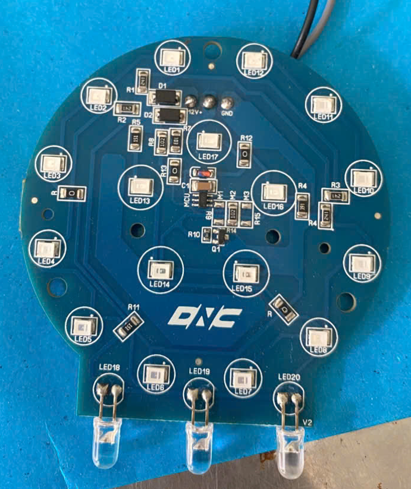

# Portfolio Template

### A beautiful minimal and accessible portfolio template for Developers ✨.

To View the live site click [here &rarr;](https://portfolio-template.surge.sh)


## Want to learn How to create a template like this ?

You can watch [this video series](https://www.youtube.com/watch?v=1nchVfpMGSg&list=PLwJBGAxcH7GzdavgKlCACbESzr-40lw3L) on my youtube channel where I re-create this from scratch. 


## Features

- Clean, Simple and Modern UI Design.
- Uses No CSS or JavaScript Frameworks or libraries as dependencies.
- Built with only HTML, CSS and a bit of JavaScript 🔨.
- Well Organized Documentation.
- Keyboard support.
- Fully Responsive.
- Loads fast ⚡.

## Lighthouse Report


### Contributions are warmly welcomed ❤️.

## Getting Started 🚀

You'll need [Git](https://git-scm.com) to be installed on your computer. 
```
# Clone this repository
$ git clone https://github.com/toannguyen1521/portfolio-template
```


## Editing the Template 🔨

Go to `index.html` and fill your information. 

### Header

In all of the places where you're supposed to fill your information you'll find HTML comments. As shown below just replace what is already in the opening and closing tags below the comment with your information.

```html
<div class="header__text-box row">
    <div class="header__text">
        <h1 class="heading-primary">
        <!-- Replace the following name with your name -->
        <span>Nguyễn Toàn</span>
        </h1>
        <!-- Put a small paragraph about yourself -->
        <p>IC/VLSI Design Student & Cybersecurity Enthusiast based in Viet Nam.</p>
        <a href="#contact" class="btn btn--pink">Get in touch</a>
    </div>
</div>
```

### Work Section

Each div with class `work__box` represents a project, replace the contents of the all the tags with the information of your projects.

```html
<div class="work__box">
    <div class="work__text">
    <h3>Experience</h3>
    <p>Participate in microchip projects organized by the School and UNITEC JAPAN CO., LTD.<p>
        <p>Self-studied STM32 microcontroller programming and embedded systems</p>
        <p>Samsung Innovation Campus</p>
        <p>Testing and troubleshooting electronic circuit boards</p>
        <p>Simulating chips and temperatures</p>
        <p>Designed single-sided PCB layouts (LED/resistor circuits) using Altium Designer software.</p>
        <ul class="work__list">
            <li>Python</li>
            <li>Verilog</li>
        </ul>

    <div class="work__links">
        <a href="#" class="link__text">
        Visit Site <span>&rarr;</span>
        </a> 
        <a href=" https://github.com/toannguyen1521/portfolio-template" target="_blank">
        
        </a>
    </div>
    </div>
    <div class="work__image-box">
        
    </div>
</div>
```

For changing the screenshot:
- first place the image in `images/` folder and then in HTML replace the name in `src` with the name of your image.

- Recommended size for project image (1366 x 767px) also make sure the size of all  project images is the same.

```html

```

### Clients Section

- Place the logos of the clients and companies that you have worked with in `images/` directory and then replace the name in `src` with the name of your logos accordingly.

- Make sure that you don't have whitespace on either side of the logos.

```html

```

### About Section

- Replace the contents in the below paragraph with information about yourself.
- Place a nice photo of yourself in the `images/` directory and then change the name in the src with your image name.

```html
<section class="about" id="about">
    <div class="row">
        <h2>About Me</h2>
        <div class="about__content">
            <div class="about__text">
                <!-- Replace the below paragraph with info about yourself -->
                <p>I am a detail-oriented IC/VLSI Design student at Duy Tan University, with a strong foundation in digital logic, embedded systems, and semiconductor simulation. Beyond my academic work, I actively pursue independent research in cybersecurity — including malware analysis and network security. I thrive under deadlines, prioritize quality in every deliverable, and am always looking to grow through hands-on projects<p>
                <!-- Provide a link to your resume -->
                <a href="#" class="btn">My Resume</a>
            </div>

            <div class="about__photo-container">
                <!-- Add a nice photo of yourself -->
                
            </div>
        </div>
    </div>
</section>
```

### Contact Section

- Modify the paragraph to your likings.
- Replace the email with yours in the `href` anchor property and the text also.

```html
<section class="contact" id="contact">
      <div class="row">
        <h2>Get in Touch</h2>
        <div class="contact__info">
          <p>
          Do you have a question? Or advice for me or just want to say "Hi 👋" in any case, feel free to let me know. Interact with me via email.<p>
          <!-- Replace the email with yours -->
          <a href="https://mail.google.com/mail/u/0/?view=cm&fs=1&to=toannguyen200662009@gmail.com" target="_blank" class="btn">toannguyen200662009@gmail.com</a>
        </div>
      </div>
</section>
```

### Footer

- Replace the `href` attribute values to your profile URLs for all anchors.
- Remove the div with class `footer__github-buttons`.

```html
<footer role="contentinfo" class="footer">
    <div class="row">
        <!-- Update the links to point to your accounts -->
        <ul class="footer__social-links">
            <li class="footer__social-link-item">
                <a href="https://x.com/NguyenToan13312">
                    
                </a>
            </li>
            <li class="footer__social-link-item">
                <a href="https://github.com/toannguyen1521/">
                    
                </a>
            </li>
            <li class="footer__social-link-item">
                <a href="https://www.facebook.com/nguyen.toann.200662009">
                    
                </a>
            </li>
            <li class="footer__social-link-item">
                <a href="https://t.me/Toan13312">
                    
                </a>
            </li>
        </ul>

        <!-- If you give me some credit by keeping the below paragraph, will be huge for me 😊 Thanks. -->
        <p>
          &copy; 2026 - Template designed & developed by <a class="link">Toan</a>.
        </p>
    </div>
</footer>
```
